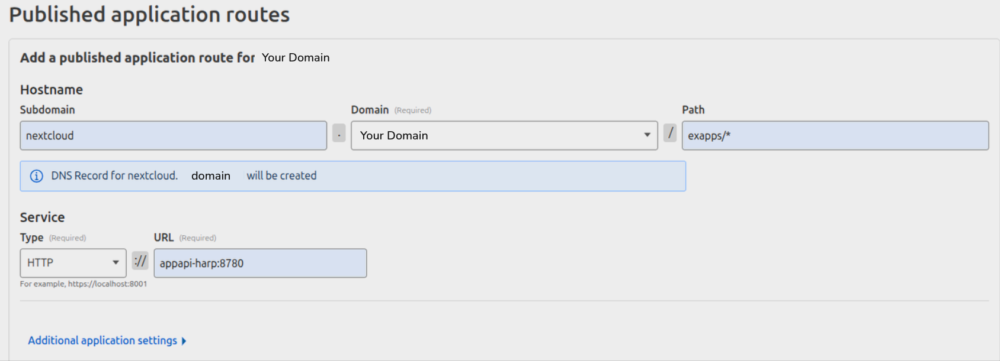
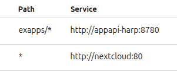

<!--
 - SPDX-FileCopyrightText: 2025 Nextcloud GmbH and Nextcloud contributors
 - SPDX-License-Identifier: AGPL-3.0-or-later
-->
# Nextcloud AppAPI HaProxy Reversed Proxy (HaRP)

---

## Overview

HaRP is a **reverse proxy system** designed to simplify the deployment workflow for Nextcloud 32’s AppAPI.

It enables direct communication between clients and ExApps, bypassing the Nextcloud instance to improve performance and reduce the complexity traditionally associated with `DockerSocketProxy` setups.

HaRP provides a flexible and scalable solution for managing ExApps, supporting deployments both locally and on remote servers.

It can be installed alongside Nextcloud or on a separate host, allowing for optimized performance and security.

The system supports simultaneous HTTP and HTTPS communication, enabling trusted networks to use direct HTTP access while securing external or untrusted connections via HTTPS.

In addition, HaRP includes built-in brute-force protection and dynamic routing capabilities, making it well-suited for a wide range of network infrastructures, from simple home setups to large distributed environments.

---

## What Does HaRP Do?

- **Simplifies Deployment:** Replaces more complex setups (such as DockerSocketProxy) with an easy-to-use container.
- **Direct Communication:** Routes requests directly to ExApps, bypassing the Nextcloud instance.
- **Enhanced Security:** Uses brute-force protection and basic authentication to secure all exposed interfaces.
- **Flexible Frontends:** Supports both HTTP and HTTPS for ExApps and Nextcloud control, and FRP (TCP) frontend.
- **Multi-Docker Management:** A single HaRP instance can manage multiple Docker engines.
- **Automated TLS for FRP:** Generates self-signed certificates for FRP communications (unless explicitly disabled).

## How to Install It

### Deploying HaRP

HaRP should be deployed where your reverse proxy (NGINX, Caddy, Traefik, etc.) can reach its `HP_EXAPPS_ADDRESS`. For home installations, you may run it on your Nextcloud instance. Below are a couple of deployment examples using Docker:

#### Basic Docker Deployment

```bash
docker run \
  -e HP_SHARED_KEY="some_very_secure_password" \
  -e NC_INSTANCE_URL="http://nextcloud.local" \
  -v /var/run/docker.sock:/var/run/docker.sock \
  -v `pwd`/certs:/certs \
  --name appapi-harp -h appapi-harp \
  --restart unless-stopped \
  -p 8780:8780 \
  -p 8782:8782 \
  -d ghcr.io/nextcloud/nextcloud-appapi-harp:release
```

> **Note:** By default, `HP_EXAPPS_ADDRESS` is set to `0.0.0.0:8780` — ensure this port is published to the desired interface (for example, host’s **127.0.0.1:8780**).

#### Using Host Networking

For even faster communication by avoiding internal network routing, you can use host networking:

```bash
docker run \
  -e HP_SHARED_KEY="some_very_secure_password" \
  -e NC_INSTANCE_URL="http://nextcloud.local" \
  -e HP_EXAPPS_ADDRESS="192.168.2.5:8780" \
  -v /var/run/docker.sock:/var/run/docker.sock \
  -v `pwd`/certs:/certs \
  --name appapi-harp -h appapi-harp \
  --restart unless-stopped \
  --network host \
  -d ghcr.io/nextcloud/nextcloud-appapi-harp:release
```

> **Warning:** Do not forget to change the **HP_SHARED_KEY** value to a secure one!

---

## Configuring Your Reverse Proxy

HaRP requires your reverse proxy to forward traffic from your public domain (e.g., `nextcloud.com/exapps/`) to the HaRP container’s `HP_EXAPPS_ADDRESS`. Below are sample configurations for NGINX, Caddy, and Traefik:

### NGINX Example

```nginx
server {
    listen 80;
    server_name nextcloud.com;

    location /exapps/ {
        proxy_pass http://127.0.0.1:8780;
        proxy_set_header Host $host;
        proxy_set_header X-Real-IP $remote_addr;
        proxy_set_header X-Forwarded-For $proxy_add_x_forwarded_for;
        proxy_set_header X-Forwarded-Proto $scheme;
        proxy_read_timeout 1800s;
    }
}
```

### Caddy Example

```caddyfile
nextcloud.com {
    reverse_proxy /exapps/* 127.0.0.1:8780 {
        transport http {
            read_timeout 1800s
        }
    }
}
```

### Traefik Example

```yaml
http:
  routers:
    exapps:
      rule: "PathPrefix(`/exapps/`)"
      service: exapps-service
      entryPoints:
        - web
  services:
    exapps-service:
      loadBalancer:
        servers:
          - url: "http://127.0.0.1:8780"
        serversTransport: exapps-transport
  serversTransports:
    exapps-transport:
      forwardingTimeouts:
        responseHeaderTimeout: 1800s
```

> **Note:** Replace `127.0.0.1` with the actual IP address of your HaRP container if it is running on a different host.

> **Note:** The `1800s` (30 minutes) read timeout matches HaRP's default `HP_TIMEOUT_SERVER` value. This is required for slow-responding ExApps (e.g., `context_chat_backend`) that may take a long time to process requests like document indexing or AI responses.

### Cloudflare Tunneling Example




> **Note:** The order of the routes matters, move the `exapp/*` route above your Nextcloud's main route.

---

## Environment Variables

HaRP is configured via several environment variables. Here are the key variables and their defaults:

- **`HP_EXAPPS_ADDRESS` / `HP_EXAPPS_HTTPS_ADDRESS`**
  - **Description:** IP:Port for ExApps HTTP/HTTPS frontends.
  - **Default:**
    - `HP_EXAPPS_ADDRESS="0.0.0.0:8780"`
    - `HP_EXAPPS_HTTPS_ADDRESS="0.0.0.0:8781"`
  - **Note:** Must be reachable by your reverse proxy.

- **`HP_TRUSTED_PROXY_IPS`**
  - **Description:** A comma-separated list of trusted reverse proxy IP addresses or CIDR ranges. When HaRP is behind another reverse proxy (like NGINX), set this to the IP of that proxy to allow HaRP to correctly identify the true client IP from `X-Forwarded-For` or `X-Real-IP` headers.
  - **Default:** `""` (disabled)
  - **Example:** `"172.18.0.0/16,127.0.0.1"`

- **`HP_FRP_ADDRESS`**
  - **Description:** IP:Port for the FRP (TCP) frontends.
  - **Default:** `HP_FRP_ADDRESS="0.0.0.0:8782"`
  - **Note:** Should be accessible from where your ExApps are running.

- **`HP_SPOA_ADDRESS`**
  - **Description:** IP:Port for the internal SPOE agent that HAProxy uses for request authentication.
  - **Default:** `HP_SPOA_ADDRESS="127.0.0.1:9600"`
  - **Note:** Only change if port 9600 conflicts with another service.

- **`HP_SHARED_KEY`** (or **`HP_SHARED_KEY_FILE`**)
  - **Description:** A secret token used for authentication between services.
  - **Requirement:** Must be set at runtime. Use only one of these methods.
  - **Important:** Must contain only ASCII characters (a-z, A-Z, 0-9, and common symbols).

- **`NC_INSTANCE_URL`**
  - **Description:** The base URL of your Nextcloud instance.
  - **Requirement:** Must be accessible from the HaRP container.

- **`HP_FRP_DISABLE_TLS`**
  - **Description:** Disables TLS for the FRP service.
  - **Default:** `HP_FRP_DISABLE_TLS="false"`
  - **Advanced:** Use only for specialized setups where TCP TLS termination is managed externally.

- **`HP_LOG_LEVEL`**
  - **Default:** `warning`
  - **Possible Values:** `debug`, `info`, `warning`, `error`

- **`HP_VERBOSE_START`**
  - **Description:** Flag that determines whether to output verbose logging to the console during  container startup.
  - **Default:** `1`

- **`HP_SESSION_LIFETIME`**
  - **Description:** A floating-point value that determines how long the Nextcloud session is retained in HaRP, in seconds. Possible values range from `0` (disable session caching) to `10` seconds.
  - **Default:** `3`

- **`HP_BLACKLIST_COUNT`**
  - **Description:** The maximum no. of bad status codes (4xx, 5xx) before the IP is banned for `HP_BLACKLIST_WINDOW` seconds.
  - **Default:** `10`

- **Timeout Variables:**
  - **`HP_TIMEOUT_CONNECT`**
    - **Description:** Maximum time allowed for establishing a connection.
    - **Default:** `30s`
  - **`HP_TIMEOUT_CLIENT`**
    - **Description:** Timeout for client-side connections.
    - **Default:** `30s`
  - **`HP_TIMEOUT_SERVER`**
    - **Description:** Timeout for server-side connections. **We do not recommend to change this value.**
    - **Default:** `1800s`
  - **`HP_BLACKLIST_WINDOW`**
    - **Description:** Timeout after which an IP is removed from the blacklist, in seconds.
    - **Default:** `300`

## Connecting Docker Engines

HaRP supports two approaches for connecting Docker Engines:

### 1. Direct Mounting (Local Docker Engine)

If your Docker Engine is running on the same host as **HaRP**, simply mount the Docker socket into the container. This direct method allows HaRP to interact with the Docker Engine immediately:

```bash
-v /var/run/docker.sock:/var/run/docker.sock
```

### 2. Connecting External Docker Engines via FRP

For remote or external Docker Engines - or if you prefer not to mount the Docker socket - you can use an FRP (Fast Reverse Proxy) client to establish a secure connection. Follow these steps:

1. **Retrieve Certificate Files:**
   HaRP automatically generates the necessary FRP certificate files, and places them in its folder `/certs/frp`. You need next files from it to connect external Docker Engine to HaRP:
   - `client.crt`
   - `client.key`
   - `ca.crt`

   ```bash
   mkdir -p harp_frpc_docker/certs/frp
   cd harp_frpc_docker
   for f in {client.crt,client.key,ca.crt}; do docker cp appapi-harp:/certs/frp/$f certs/frp/; done
   ```

2. **Create an FRP Client Configuration:**
   With the certificate files in hand, create a configuration file (for example, `frpc.toml`) on the Docker Engine host in the "harp_frpc_docker" folder. Below is a sample configuration:

   ```toml
   # frpc.toml
   serverAddr = "your.harp.server.address"          # Replace with your HP_FRP_ADDRESS host
   serverPort = 8782                                # Default port for FRP or the port your reverse proxy listens on
   loginFailExit = false                            # If the FRP (HaRP) server is unavailable, continue trying to log in.

   transport.tls.certFile = "certs/frp/client.crt"
   transport.tls.keyFile = "certs/frp/client.key"
   transport.tls.trustedCaFile = "certs/frp/ca.crt"
   transport.tls.serverName = "harp.nc"             # DO NOT CHANGE THIS VALUE

   metadatas.token = "HP_SHARED_KEY"                # HP_SHARED_KEY in quotes

   [[proxies]]
   remotePort = 24001                               # Unique remotePort for each Docker Engine (range: 24001-24099)
   name = "deploy-daemon-1"                         # Unique name for each Docker Engine
   type = "tcp"
   [proxies.plugin]
   type = "unix_domain_socket"
   unixPath = "/var/run/docker.sock"
   ```

3. **Deploy the FRP Client:**
   Run the FRP client on the host with the Docker Engine using the configuration file. This establishes a secure tunnel between the remote Docker Engine and HaRP. Each connection requires a unique `remotePort` value; HaRP supports up to 99 Docker Engines by assigning a different port in the allowed range.

   Run like this:

   ```bash
    frpc -c /path/to/frpc.toml
   ```

   Or with docker:

   ```bash
   docker run \
     -v /path/to/frpc.toml:/etc/frpc.toml \
     -v `pwd`/certs:/certs \
     -v /var/run/docker.sock:/var/run/docker.sock \
     --restart unless-stopped \
     -d --name harp_frpc_docker \
     -- ghcr.io/fatedier/frpc:v0.61.1 "-c=/etc/frpc.toml"
   ```

   Or with docker compose:

   ```yaml
   services:
     harp_frpc_docker:
       image: ghcr.io/fatedier/frpc:v0.61.1
       container_name: harp_frpc_docker
       volumes:
         - ./frpc.toml:/etc/frpc.toml
         - ./certs:/certs
         - /var/run/docker.sock:/var/run/docker.sock
       restart: unless-stopped
       command: -c=/etc/frpc.toml
   ```
   ```bash
   docker compose up -d
   ```

The FRP client-server connections, i.e. the connection from the above FRP client to the FRP server in the HaRP container, can be passed through the same reverse proxy as the Nextcloud instance for better security. The following is an example of how to configure NGINX for this purpose:

```nginx
  stream {
      server {
          listen 8782;  # Replace with the port you want to listen on
          proxy_pass 127.0.0.1:8782;
          proxy_protocol off;
          proxy_connect_timeout 10s;
          proxy_timeout 300s;
      }
  }
```

## Adapting ExApps to use HaRP

> We strongly recommend starting support for `HaRP` in ExApps from the start of Nextcloud `32`, as the old `DSP` way will be deprecated and marked for removal in Nextcloud `35`.
>
> Adding `HaRP` support is fully compatible with the existing `DSP` system, so you won’t need to maintain two separate release types of your ExApp.

1. Copy the `start.sh` script from the `exapps_dev` folder of the HaRP repository into your Docker image (e.g., using a `COPY` instruction).
2. In your ExApp's `Dockerfile`, set the `ENTRYPOINT` to execute `start.sh` followed by the **command and arguments required to launch** your actual application. The `start.sh` script will perform launch of `FRP` client if needed and then use `exec` to run the command you provide as arguments.
3. Ensure the `curl` command-line utility is installed in your ExApp's Docker image, as it's needed by the following script to download the FRP client.
4. Add the following lines to your `Dockerfile` to automatically include the `FRP client` binaries in your Docker image:

    ```dockerfile
    # Download and install FRP client with checksum verification
    # FRP version and checksums - update these when upgrading
    ARG FRP_VERSION=0.61.1
    ARG FRP_AMD64_SHA256=bff260b68ca7b1461182a46c4f34e9709ba32764eed30a15dd94ac97f50a2c40
    ARG FRP_ARM64_SHA256=af6366f2b43920ebfe6235dba6060770399ed1fb18601e5818552bd46a7621f8

    RUN set -ex; \
        ARCH=$(uname -m); \
        if [ "$ARCH" = "aarch64" ]; then \
            FRP_ARCH="arm64"; \
            FRP_SHA256="${FRP_ARM64_SHA256}"; \
        else \
            FRP_ARCH="amd64"; \
            FRP_SHA256="${FRP_AMD64_SHA256}"; \
        fi; \
        FRP_URL="https://github.com/fatedier/frp/releases/download/v${FRP_VERSION}/frp_${FRP_VERSION}_linux_${FRP_ARCH}.tar.gz"; \
        echo "Downloading FRP v${FRP_VERSION} for ${FRP_ARCH}..."; \
        curl -fsSL "${FRP_URL}" -o /tmp/frp.tar.gz; \
        echo "${FRP_SHA256}  /tmp/frp.tar.gz" | sha256sum -c -; \
        tar -C /tmp -xzf /tmp/frp.tar.gz; \
        cp /tmp/frp_${FRP_VERSION}_linux_${FRP_ARCH}/frpc /usr/local/bin/frpc; \
        chmod +x /usr/local/bin/frpc; \
        rm -rf /tmp/frp_${FRP_VERSION}_linux_${FRP_ARCH} /tmp/frp.tar.gz; \
        echo "FRP client installed successfully"
    ```

    > **Note:** The checksums are verified against the official FRP releases to prevent supply chain attacks. When upgrading FRP, update both the version and checksums from the [FRP releases page](https://github.com/fatedier/frp/releases).

    > **Note:** For `Alpine 3.21` Linux you can just install `FRP` from repo using `apk add frp` command.

That's it! Your ExApp is now adapted to Nextcloud 32.

## Nextcloud 32: Migrating Existing ExApps from DSP to HaRP

> **Note:** All ExApps developed by Nextcloud will support HaRP when Nextcloud 32 is released. We hope that most ExApps from the community will also support it. **Contact us if you need assistance.**

If you've upgraded to Nextcloud 32 and want to switch from using DSP to HaRP, follow these steps:

1. **Install HaRP** on the same Docker Engine that you were using for DSP.
2. **Test Deployment on HaRP** with usual `TestDeploy` button.
3. **Set HaRP as the default deployment daemon** for ExApps.
4. **Remove the ExApps without deleting their data volumes**:
   - **Terminal**: Do not use the `--rm-data` option when removing the app.
   - **From UI**: Do not use the "Delete data when removing" checkbox.
5. **Install the ExApp**: Install removed ExApps, now they will be installed on `HaRP`.
6. **Remove DSP**: Now DSP (Docker Socket Proxy) can be safely removed.

## Building & Deploying HaRP from Source

This section provides helper information for developing and modifying HaRP. The `nextcloud-docker-dev` environment will be used for this purpose.

### Remove Any Existing HaRP Container

```bash
docker container remove --force appapi-harp
````

### Build a Local HaRP Image from Source

```bash
docker build -t nextcloud-appapi-harp:local .
```

### Deploy HaRP Using the Locally Built Image

```bash
docker run \
  -e HP_SHARED_KEY="some_very_secure_password" \
  -e NC_INSTANCE_URL="http://nextcloud.local" \
  -e HP_LOG_LEVEL="debug" \
  -e HP_VERBOSE_START="1" \
  -e HP_TRUSTED_PROXY_IPS="192.168.0.0/16" \
  -v /var/run/docker.sock:/var/run/docker.sock \
  -v `pwd`/certs:/certs \
  --name appapi-harp -h appapi-harp \
  --restart unless-stopped \
  --network=master_default \
  -p 8780:8780 \
  -p 8782:8782 \
  -d nextcloud-appapi-harp:local
```

> [!important]
> Be mindful of checking and changing the environment variables `HP_SHARED_KEY`, `NC_INSTANCE_URL`, and `HP_TRUSTED_PROXY_IPS` in the above command to suit your environment and setup.

#### Debugging HaRP

##### One time initializing steps:

1. Create virtual environment
2. Install `pydantic` (you can look at exact version in the **Dockerfile*) and `git+https://github.com/cloud-py-api/haproxy-python-spoa.git`
3. Set next environment variables for running `haproxy_agent.py` script:
    ```
    HP_LOG_LEVEL=info;NC_INSTANCE_URL=http://nextcloud.local;HP_SHARED_KEY=some_very_secure_password;HP_FRP_DISABLE_TLS=true
    ```
4. Create folder `dev` at the root of repository, extract there content of the desired archive with the [FRP](https://github.com/fatedier/frp/releases/latest) archive which is located at `exapps_dev` folder of this repo.
5. Edit the `data/nginx/vhost.d/nextcloud.local_location` file from the `nextcloud-docker-dev` to point `/exapps/` web route to the host:
    ```
    proxy_pass http://172.17.0.1:8780;
    ```

    > **Note:** my original content from my dev machine of file `nextcloud.local_location`:
    > ```nginx
    > location /exapps/ {
    >   proxy_pass http://172.17.0.1:8780;
    > }
    > ```
6. Use `docker compose up -d --force-recreate proxy` command from Julius `nextcloud-docker-dev` to recreate the proxy container.
7. Register `HaRP` from the **Host** template. Replace `localhost` with `host.docker.internal` in `HaRP Host` field.

##### Steps to run all parts of HaRP after initializing:

1. Run FRP Server with `./dev/frps -c ./development/debugging/frps.toml` command.
2. Run the FRP Client to connect Docker Engine to the FRP Server with `./dev/frpc -c ./development/debugging/frpc.toml` command.
3. Run `./development/debugging/redeploy_haproxy_host.sh` command to redeploy `appapi-harp` container **with HaProxy only**.

> **Note:** Existing `appapi-harp` container will be removed.

## Troubleshooting

### Verify that HaRP can reach the Docker Engine

Use the Docker Engine `/_ping` endpoint via HaRP’s ExApps HTTP frontend to confirm connectivity:

```
curl -fsS \
  -H "harp-shared-key: <HP_SHARED_KEY>" \
  -H "docker-engine-port: 24000" \
  http://127.0.0.1:8780/exapps/app_api/v1.41/_ping
```

* `24000` is the **default** FRP remote port used by the HaRP container for the **built‑in/local** Docker Engine (enabled when `/var/run/docker.sock` is mounted).
* If you have connected **additional** Docker Engines via FRP, replace `24000` with the corresponding `remotePort` you configured (typically `24001–24099`).
* A response body of `OK` means the Docker Engine API is reachable from HaRP.

**Common outcomes**

* `OK` – Success: HaRP can reach the Docker Engine on the given port.
* `401 Unauthorized` – The `harp-shared-key` header does not match `HP_SHARED_KEY`.
* `503 Service Unavailable` / `504 Gateway Timeout` – Wrong docker-engine-port, FRP tunnel is down, or the Docker Engine is not reachable.
* Connection errors – The address in `HP_EXAPPS_ADDRESS` (port `8780` by default) is not reachable from where you ran curl.

> **Note:** If you expose the ExApps frontend over HTTPS (via `HP_EXAPPS_HTTPS_ADDRESS` and a mounted `/certs/cert.pem`), use `https://...:8781` instead of `http://...:8780`.

#### Verify Docker Engines from inside the HaRP container

These checks run **inside the HaRP container** (e.g., `docker exec -it appapi-harp sh`).

**1) Local Docker Engine (mapped socket)**

   Confirm the host’s Docker socket is correctly mounted and reachable:

   ```
   # Directly against the mounted UNIX socket
   curl -fsS --unix-socket /var/run/docker.sock http://localhost/_ping
   # Expected: OK
   ```

   You can also verify the FRP tunnel that HaRP exposes for the bundled local engine (port 24000):

   ```
   curl -fsS http://127.0.0.1:24000/_ping
   # Expected: OK
   ```

**2) Remote Docker Engine over FRP**

   For each external Docker Engine you connected via FRP (each with a unique `remotePort`, typically **24001–24099**), test the TCP port that FRP exposes **on the HaRP container**:

   ```
   # Replace 24001 with the remotePort you configured in that engine's frpc.toml
   curl -fsS http://127.0.0.1:24001/_ping
   # Expected: OK
   ```

### Verify that the Reverse Proxy configuration is correct

Stop the HaRP container temporarily and start a dummy server with `nc` (netcat) to confirm that your reverse proxy is forwarding requests correctly with all the headers:

```bash
# Stop HaRP container
docker stop appapi-harp
# Start a dummy server on the same port as HaRP's ExApps frontend
nc -l -k -p 8780
```

Now, send a request through your reverse proxy to the ExApps endpoint (e.g., `https://cloud.example.com/exapps/hello`):

```bash
curl -v https://cloud.example.com/exapps/hello
```

For nginx, you should see output similar to this in the terminal where `nc` is running:

```
GET /exapps/hello HTTP/1.1
Host: cloud.example.com
Connection: close
X-Real-IP: 20.207.73.82
X-Forwarded-For: 20.207.73.82 192.168.21.1
X-Forwarded-Host: cloud.example.com
X-Forwarded-Proto: https
X-Forwarded-Ssl: on
X-Forwarded-Port: 443
X-Original-URI: /exapps/hello
X-Forwarded-Proto: https
user-agent: curl/8.11.1
accept: */*
```

## Contributing

Contributions to HaRP are welcome. Feel free to open issues, discussions or submit pull requests with improvements, bug fixes, or new features.
